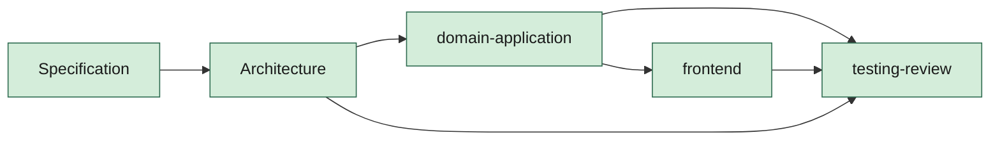

# AGENTS.md — Router de agentes ShiftFlow

| Campo | Valor |
|--------|--------|
| Versión | 0.4.0 |
| Estado | Draft |
| Fecha | 2026-09-25T11:33+02:00 |
| Norma | `sdaf-core/handbook/06`, `07`, `08`, `10`, `13`; pack `sdaf-stack-dotnet` |
| Config | `sdaf.config.yaml` |
| Core | `sdaf-core` @ v0.4.0 (línea `0.4.0`) |
| Pack | `sdaf-stack-dotnet` @ v0.3.0 |

---

## Propósito

Ingeniería de la reconstrucción de ShiftFlow. Gate 0 obligatorio antes de código en `src/`.

> [!CAUTION]
> Antes de cualquier feature: Gate 0 ([sdaf-core/handbook/05](sdaf-core/handbook/05-development-workflow.md)).

## Modelo

| Estado | Agentes |
|--------|---------|
| **Activo** | Specification, Architecture, Domain+Application, Frontend, Testing+Review |
| **Stub** | Product, Domain, Application, Infrastructure, DevOps, Review, Testing, AI |

## Handoff canónico

El saliente cierra worklog con «siguiente agente». El entrante lee worklog + specs; no depende del chat efímero.

## Inventario

Contratos en `agents/` y prompts en `prompts/agents/` son **symlinks** al pin de core/pack; materializar con [`scripts/materialize-submodules.ps1`](scripts/materialize-submodules.ps1) (ver [`docs/materializacion-submodules.md`](docs/materializacion-submodules.md)).

### Núcleo (`sdaf-core`)

| Agente | Contrato | Estado |
|--------|----------|--------|
| Specification | [agents/specification-agent.md](agents/specification-agent.md) | active |
| Architecture | [agents/architecture-agent.md](agents/architecture-agent.md) | active |
| Testing+Review | [agents/testing-review-agent.md](agents/testing-review-agent.md) | active |
| Stubs Product/Domain/Application/DevOps/Review/Testing | [agents/](agents/) | stub |

### Pack (`sdaf-stack-dotnet`)

| Agente | Contrato | Estado |
|--------|----------|--------|
| Domain+Application | [agents/domain-application-agent.md](agents/domain-application-agent.md) | active |
| Frontend | [agents/frontend-agent.md](agents/frontend-agent.md) | active |
| Infrastructure | [agents/infrastructure-agent.md](agents/infrastructure-agent.md) | stub |

## Contexto autorizado (activos)

Índice. Abrir los artefactos; no concatenar en un mega-prompt. Si resumen y prompt discrepan, gana el prompt. Detalle en cada contrato.

| Agente | Rol | Flujo típico | IDE |
|--------|-----|--------------|-----|
| Specification | `prompts/agents/specification-agent.md` | `spec-draft-pbi`, `sdaf-worklog-handoff` | `idioma-castellano`, `git-remoto-encargo` |
| Architecture | `prompts/agents/architecture-agent.md` | `adr-propose`, `sdaf-worklog-handoff` | `idioma-castellano`, `git-remoto-encargo` |
| Testing+Review | `prompts/agents/testing-review-agent.md` | `sdaf-gate0`, `testing-review-pr`, `security-review` (si aplica), `sdaf-worklog-handoff` | `idioma-castellano`, `git-remoto-encargo` |
| Domain+Application | `prompts/agents/domain-application-agent.md` | `csharp-adr006-slice`, `sdaf-gate0`, `sdaf-worklog-handoff` | `idioma-castellano`, `git-remoto-encargo`, `coding-standards-csharp` |
| Frontend | `prompts/agents/frontend-agent.md` | `blazor-bff-slice`, `sdaf-gate0`, `sdaf-worklog-handoff` | `idioma-castellano`, `git-remoto-encargo`, `coding-standards-csharp` |

**Stubs:** solo contrato + prompt base hasta activación humana explícita. `PROMPT-SYS-001` es gobernanza de director; no forma parte del paquete de implementación.

Worklogs **nuevos** (desde la línea 0.4.0): frontmatter de [`sdaf-core/templates/worklog.md`](sdaf-core/templates/worklog.md) (`commit`, `pr`, `rama`, `sha` o `null`), línea de decisión y origen de cambios (H08 §4.1–4.3). Los worklogs en tabla siguen válidos; sin backfill. No reescribir `worklogs/TRANSPLANTE/` ni `INIT-REBUILD/`.

## Skills

Citar `skill-id@version` en worklogs (H06 §6, H07).

| Prioridad | Skills (core) |
|-----------|----------------|
| Alta | `sdaf-gate0`, `sdaf-worklog-handoff`, `sdaf-agent-router`, `sdaf-bootstrap`, `testing-review-pr`, `security-review` |
| Media | `spec-draft-pbi`, `adr-propose`, `sdaf-upgrade` |
| Baja | `devops-ci-gate` |

- Core: [skills/](skills/)
- Pack: `csharp-adr006-slice`, `blazor-bff-slice`, `aspire-local-run`
- Cursor: `.cursor/skills/<id>` → submodule (misma fuente que `skills/<id>`)

## Gobierno

- Aceptación humana y QG-Review: la identidad de [`CODEOWNERS`](CODEOWNERS) (H10, H13 §2 y §7). El dictamen de un agente no es el merge.
- Seguridad: [`SECURITY.md`](SECURITY.md) y QG-Sec (H12 §5.2).
- Git/remoto: solo si **este turno** lo nombra (`.cursor/rules/git-remoto-encargo.mdc`; H06 §7).
- Fechas nuevas en ISO 8601 con hora y zona (H13 §9).
- Adopción / upgrade: [sdaf-core/docs/adopcion-y-upgrade.md](sdaf-core/docs/adopcion-y-upgrade.md).

## Restricciones

Ningún agente: aprueba handbook/specs por sí solo; salta Gate 0; implementa alcance Out del corte vigente; introduce secretos; altera el remoto ni crea commit local sin petición humana explícita **en este turno** (H06 §7: el historial de la conversación no autoriza); ejecuta force-push, reescribe historia o auto-merge sin orden humana. Castellano en artefactos de ingeniería.

## Historial

| Versión | Fecha | Cambio |
|---------|--------|--------|
| 0.2.1 | 2026-09-13 | Fila inicial de historial (cabecera ya publicada) |
| 0.4.0 | 2026-09-25T11:33+02:00 | Upgrade a sdaf-core v0.4.0 y sdaf-stack-dotnet v0.3.0: plantilla 0.3.3, skills Parte III, `git-remoto-encargo`, CODEOWNERS, SECURITY y worklogs con frontmatter |
