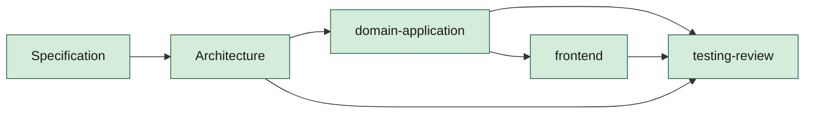

# AGENTS.md — Router de agentes ShiftFlow

| Campo | Valor |
|--------|--------|
| Versión | 0.4.6 |
| Estado | Draft |
| Fecha | 2026-09-27T20:26+02:00 |
| Norma | `sdaf-core/handbook/06`, `07`, `08`, `10`, `13`; pack `sdaf-stack-dotnet` |
| Config | `sdaf.config.yaml` (con `tooling.gentle_ai`) |
| Core | `sdaf-core` @ v0.4.2 (línea `0.4.0`) |
| Pack | `sdaf-stack-dotnet` @ v0.3.0 |

---

## Propósito

Ingeniería de la reconstrucción de ShiftFlow. Gate 0 obligatorio antes de código en `src/`.

> [!CAUTION]
> Antes de cualquier feature: Gate 0 ([sdaf-core/handbook/05](sdaf-core/handbook/05-development-workflow.md)).

## Modelo

| Estado | Agentes |
|--------|---------|
| **Activo** | Specification, Architecture, Domain+Application, Frontend, Testing+Review |
| **Stub** | Product, Domain, Application, Infrastructure, DevOps, Review, Testing, AI |

## Handoff canónico

```mermaid
flowchart LR
  Spec[Specification] --> Arch[Architecture]
  Arch --> DA[domain-application]
  DA --> FE[frontend]
  DA --> TR[testing-review]
  FE --> TR
  Arch --> TR
  classDef ok fill:#d4edda,stroke:#2d6a4f,color:#1a1a1a;
  class Spec,Arch,DA,FE,TR ok
```

El saliente cierra worklog con «siguiente agente». El entrante lee worklog + specs; no depende del chat efímero.

## Inventario

Contratos en `agents/` y prompts en `prompts/agents/` son **symlinks** al pin de core/pack; materializar con [`scripts/materialize-submodules.ps1`](scripts/materialize-submodules.ps1) (ver [`docs/materializacion-submodules.md`](docs/materializacion-submodules.md)).

### Núcleo (`sdaf-core`)

| Agente | Contrato | Estado |
|--------|----------|--------|
| Specification | [agents/specification-agent.md](agents/specification-agent.md) | active |
| Architecture | [agents/architecture-agent.md](agents/architecture-agent.md) | active |
| Testing+Review | [agents/testing-review-agent.md](agents/testing-review-agent.md) | active |
| Stubs Product/Domain/Application/DevOps/Review/Testing | [agents/](agents/) | stub |

### Pack (`sdaf-stack-dotnet`)

| Agente | Contrato | Estado |
|--------|----------|--------|
| Domain+Application | [agents/domain-application-agent.md](agents/domain-application-agent.md) | active |
| Frontend | [agents/frontend-agent.md](agents/frontend-agent.md) | active |
| Infrastructure | [agents/infrastructure-agent.md](agents/infrastructure-agent.md) | stub |

## Contexto autorizado (activos)

Índice. Abrir los artefactos; no concatenar en un mega-prompt. Si resumen y prompt discrepan, gana el prompt. Detalle en cada contrato.

| Agente | Rol | Flujo típico | IDE |
|--------|-----|--------------|-----|
| Specification | `prompts/agents/specification-agent.md` | `spec-draft-pbi`, `sdaf-worklog-handoff` | `idioma-castellano`, `git-remoto-encargo` |
| Architecture | `prompts/agents/architecture-agent.md` | `adr-propose`, `sdaf-worklog-handoff` | `idioma-castellano`, `git-remoto-encargo` |
| Testing+Review | `prompts/agents/testing-review-agent.md` | `sdaf-gate0`, `testing-review-pr`, `security-review` (si aplica), `sdaf-worklog-handoff` | `idioma-castellano`, `git-remoto-encargo` |
| Domain+Application | `prompts/agents/domain-application-agent.md` | `csharp-adr006-slice`, `sdaf-gate0`, `sdaf-worklog-handoff` | `idioma-castellano`, `git-remoto-encargo`, `coding-standards-csharp` |
| Frontend | `prompts/agents/frontend-agent.md` | `blazor-bff-slice`, `sdaf-gate0`, `sdaf-worklog-handoff` | `idioma-castellano`, `git-remoto-encargo`, `coding-standards-csharp` |

**Stubs:** solo contrato + prompt base hasta activación humana explícita. `PROMPT-SYS-001` es gobernanza de director; no forma parte del paquete de implementación.

Worklogs **nuevos** (desde la línea 0.4.0): frontmatter de [`sdaf-core/templates/worklog.md`](sdaf-core/templates/worklog.md) (`commit`, `pr`, `rama`, `sha` o `null`), línea de decisión y origen de cambios (H08 §4.1–4.3). Los worklogs en tabla siguen válidos; sin backfill. No reescribir `worklogs/TRANSPLANTE/` ni `INIT-REBUILD/`.

## Skills

Citar `skill-id@version` en worklogs (H06 §6, H07).

| Prioridad | Skills (core) |
|-----------|----------------|
| Alta | `sdaf-gate0`, `sdaf-worklog-handoff`, `sdaf-agent-router`, `sdaf-bootstrap`, `testing-review-pr`, `security-review` |
| Media | `spec-draft-pbi`, `adr-propose`, `sdaf-upgrade` |
| Baja | `devops-ci-gate` |

- Core: [skills/](skills/)
- Pack: `csharp-adr006-slice`, `blazor-bff-slice`, `aspire-local-run`
- Cursor: `.cursor/skills/<id>` → submodule (misma fuente que `skills/<id>`)

## Tooling externo (gentle-ai)

> [!NOTE]
> `sdaf.config.yaml` declara `tooling.gentle_ai` (SHA de `main` posterior a la retirada de SDD). Guía del core: [sdaf-core/docs/integracion-gentle-ai.md](sdaf-core/docs/integracion-gentle-ai.md) ([ADR-004 de sdaf-core](sdaf-core/architecture/decisions/ADR-004-tooling-externo-de-agentes.md); no confundir con el ADR-004 de layout de este repo).

Precedencia: este `AGENTS.md`, el handbook y las specs Approved mandan sobre las instrucciones que inyecta el tooling.

- Gate 0 antes de código de producto. No usar skills `sdd-*`: las specs viven en `specs/` y las aprueba un humano.
- H06 §7 prevalece sobre el cierre de tareas de ODD: sin commit, rama remota ni PR salvo que el encargo vigente los nombre. Sin excepción enumerada.
- RDD (`gentle-ai review`), antes del PR: si el humano lo activa, tras cada commit ordenado se revisa el rango commiteado siguiendo solo el `next_transition` del preflight `gentle-ai review status --contract gentle-ai.review-integration/v2 --agent claude-code --next-transition`, hasta `target_already_acknowledged`. El consentimiento que devuelva se traslada al humano; el agente no lo responde. Push y PR siguen exigiendo el encargo vigente, con la review cerrada y sus hallazgos citados en el PR. El stop-hook de gentle-ai bloquea el cierre de turno con cambios sin revisar. Sobre el candidato final del turno se atiende con su mismo preflight. Si el candidato es intermedio (trabajo a medias o de un subagente en curso), el agente lo dice en la respuesta y cierra el turno sin revisarlo; si el hook vuelve a bloquear sobre ese mismo candidato, se revisa. La excepción no cierra el trabajo: antes de darlo por terminado, el candidato final se revisa siempre con el preflight. Que el hook avise una sola vez por candidato solo se ha observado una vez (2026-09-27). El dictamen alimenta `testing-review-pr` y no es QG-Review (ADR-004 de sdaf-core, decisión 6); el worklog cita el linaje y el `sha`. Activarlo o desactivarlo es decisión humana (`gentle-ai review mode`). Mientras esté desactivado o no disponible, se trabaja sin él. Flujo, coste y resultados del piloto: [`docs/piloto-rdd-hibrido.md`](docs/piloto-rdd-hibrido.md).
- `odd/tasks/` es borrador (no versionado). La evidencia es el worklog en `worklogs/`.
- La memoria del tooling (Engram) es caché de contexto y no se versiona. Ante contradicción, mandan specs y worklog.

## Gobierno

- Aceptación humana y QG-Review: la identidad de [`CODEOWNERS`](CODEOWNERS) (H10, H13 §2 y §7). El dictamen de un agente no es el merge.
- Seguridad: [`SECURITY.md`](SECURITY.md) y QG-Sec (H12 §5.2).
- Git/remoto: solo si **este turno** lo nombra (`.cursor/rules/git-remoto-encargo.mdc`; H06 §7).
- Fechas nuevas en ISO 8601 con hora y zona (H13 §9).
- Adopción / upgrade: [sdaf-core/docs/adopcion-y-upgrade.md](sdaf-core/docs/adopcion-y-upgrade.md).

## Restricciones

Ningún agente: aprueba handbook/specs por sí solo; salta Gate 0; implementa alcance Out del corte vigente; introduce secretos; altera el remoto ni crea commit local sin petición humana explícita **en este turno** (H06 §7: el historial de la conversación no autoriza); ejecuta force-push, reescribe historia o auto-merge sin orden humana. Castellano en artefactos de ingeniería.

## Historial

| Versión | Fecha | Cambio |
|---------|--------|--------|
| 0.2.1 | 2026-09-13 | Fila inicial de historial (cabecera ya publicada) |
| 0.4.0 | 2026-09-25T11:33+02:00 | Upgrade a sdaf-core v0.4.0 y sdaf-stack-dotnet v0.3.0: plantilla 0.3.3, skills Parte III, `git-remoto-encargo`, CODEOWNERS, SECURITY y worklogs con frontmatter |
| 0.4.2 | 2026-09-26T23:12+02:00 | Pin sdaf-core v0.4.2; adopción de gentle-ai (`tooling.gentle_ai`) con la sección «Tooling externo» de la plantilla 0.4.2, sin excepción H06 §7 |
| 0.4.3 | 2026-09-27T08:42+02:00 | RDD de gentle-ai permitido solo antes del commit (`--projection staged`), sin excepción H06 §7; guion en `docs/piloto-rdd-hibrido.md` |
| 0.4.4 | 2026-09-27T10:00+02:00 | RDD pasa a antes del PR: el piloto mostró que la review previa al commit no se enlaza al rango commiteado (C1); sin excepción H06 §7 |
| 0.4.5 | 2026-09-27T19:15+02:00 | Stop-hook: excepción para candidatos intermedios con salida si vuelve a bloquear (hallazgo R3-stophook-rule-divergence de `review-6e6ff05d9acb94b2`, PR 18) |
| 0.4.6 | 2026-09-27T20:26+02:00 | Stop-hook: la excepción de candidato intermedio no cierra el trabajo; el candidato final se revisa siempre (hallazgo R3-intermediate-candidate-unbounded-skip de `review-8705a9dd29a0a57a`, PR 19) |
