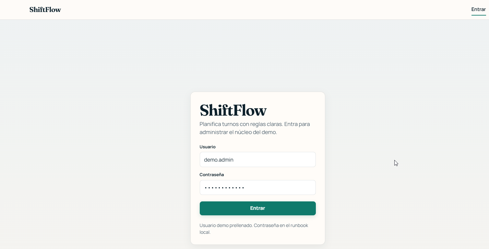
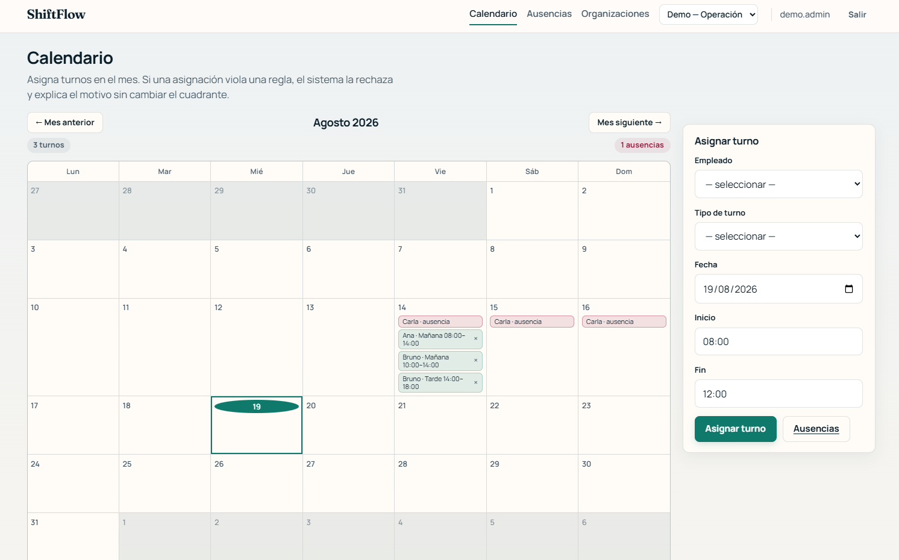

# 🗓️ ShiftFlow

 

**ShiftFlow** es una aplicación de planificación de turnos: organizaciones, departamentos, empleados, tipos de turno, calendario de asignaciones y ausencias, con un motor de reglas que bloquea asignaciones inválidas (solapes, ausencias activas, descanso mínimo).

Este repositorio es además un caso de estudio de **SDAF** (*Spec-Driven Agentic Framework*): todo el producto se construyó bajo especificaciones aprobadas, ADRs y Gate 0 antes de escribir código. Si solo te interesa el producto, puedes ignorar esa capa por completo — está aislada en [`specs/`](specs/README.md), [`architecture/`](architecture/decisions/README.md), [`handbook/`](handbook/README.md) y [`agents/`](AGENTS.md).

---

## 🧩 Qué hace

| Capacidad | Descripción |
|-----------|-------------|
| 🏢 Maestros | Organizaciones, departamentos, empleados, tipos de turno |
| 📅 Calendario | Vista mensual + asignación manual de turnos por empleado |
| 🚫 Reglas duras | `HR-01` solape, `HR-02` ausencia activa, `HR-03` descanso mínimo — bloquean la asignación con explicación (ver [motor de reglas](docs/architecture.md) y [cómo provocarlas](docs/user-guide.md)) |
| 🌴 Ausencias | Alta/cancelación de ausencias (*leaves*) que afectan al calendario |
| 🔐 Auth | Login por cookie/Identity + token Bearer para el cliente Blazor (BFF), rol `Administrator` (ver [`ADR-005`](architecture/decisions/ADR-005-auth-basica-mvp.md)) |

## 🖼️ Capturas

| Login | Calendario | Rechazo por regla |
|-------|------------|--------------------|
|  |  |  |

## 🧱 Stack

| Pieza | Tecnología |
|-------|------------|
| Runtime | .NET **10** |
| Orquestación local | **.NET Aspire** (`ShiftFlow.AppHost`) |
| API | ASP.NET Core Minimal APIs + MediatR (CQRS por vertical slice) |
| Persistencia | EF Core 10 + Npgsql sobre **PostgreSQL** |
| Auth | ASP.NET Core Identity (cookie) + token Bearer para el BFF |
| Web | Blazor (`ShiftFlow.Web`), cliente del API vía service discovery de Aspire |
| Logging | Serilog |
| Docs de API | OpenAPI (`/openapi/v1.json` en Development) |

📐 Arquitectura por capas (Domain / Application / Infrastructure / Api / Web): ver [`docs/architecture.md`](docs/architecture.md).

---

## 🚀 Arranque rápido

Requisitos: **.NET 10 SDK**, **Docker Desktop**.

```powershell
git clone --recurse-submodules https://github.com/Cyberdine-Systems-Corporation/ShiftFlow-sdaf.git
cd ShiftFlow-sdaf
dotnet run --project src/ShiftFlow.AppHost --launch-profile https
```

Aspire levanta PostgreSQL + Api + Web. Login demo: usuario `demo.admin`, contraseña `ChangeMe!123` (solo desarrollo) — detalle en [usuario demo](docs/runbook-local.md#8-usuario-demo).

📖 Guía paso a paso (migraciones, catálogo de demo, troubleshooting, Compose de contingencia): [`docs/runbook-local.md`](docs/runbook-local.md).

## 📚 Documentación

| Quiero... | Ir a |
|-----------|------|
| 🚀 Arrancar el proyecto localmente | [`docs/runbook-local.md`](docs/runbook-local.md) |
| 🧭 Entender cómo usar la app (organizaciones, calendario, reglas) | [`docs/user-guide.md`](docs/user-guide.md) |
| 🏗️ Ver la arquitectura y las capas | [`docs/architecture.md`](docs/architecture.md) |
| 🔌 Consultar los endpoints del API | [`docs/api.md`](docs/api.md) |
| ⚠️ Ver limitaciones conocidas y configuración | [`docs/architecture.md#limitaciones-conocidas`](docs/architecture.md#limitaciones-conocidas) |
| 🤝 Contribuir código (estándares, tests) | [`CONTRIBUTING.md`](CONTRIBUTING.md) |
| 📐 Ver decisiones de arquitectura (ADRs) | [`architecture/decisions/`](architecture/decisions/README.md) |
| 📋 Ver especificaciones aprobadas | [`specs/`](specs/README.md) |
| 🎬 Ver el vídeo/deck de presentación del MVP | [`docs/presentation/mvp-0.1/`](docs/presentation/mvp-0.1/README.md) |

---

## 🗺️ Método SDAF (gobernanza)

Este repo es un **consumidor** del método SDAF: [`sdaf-core`](sdaf-core/README.md) (submódulo, método) + [`sdaf-stack-dotnet`](sdaf-stack-dotnet/README.md) (submódulo, pack de stack). Ver [`AGENTS.md`](AGENTS.md) para el router de agentes y contratos.

| Componente | Pin |
|------------|-----|
| Método | [`sdaf-core`](sdaf-core/README.md) @ v0.2.1 |
| Pack | [`sdaf-stack-dotnet`](sdaf-stack-dotnet/README.md) @ v0.1.1 |
| Extract (fuente histórica) | [`ShiftFlow-sdaf-extract`](https://github.com/Cyberdine-Systems-Corporation/ShiftFlow-sdaf-extract) |

Clonado con submódulos (necesario para materializar agentes/prompts vía symlinks):

```powershell
git submodule update --init --recursive
git config core.symlinks true
.\scripts\materialize-submodules.ps1 -Force
```

🪟 Prerrequisitos de symlinks en Windows: [`docs/materializacion-submodules.md`](docs/materializacion-submodules.md).

> ⚠️ **Reglas:** no aprobar normas de método · no saltar Gate 0 antes de código en `src/` · sin secretos en el repo.

---

## 📄 Licencia

[MIT](LICENSE) © Cyberdine Systems Corporation
