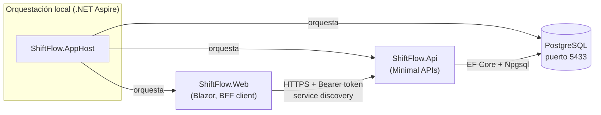
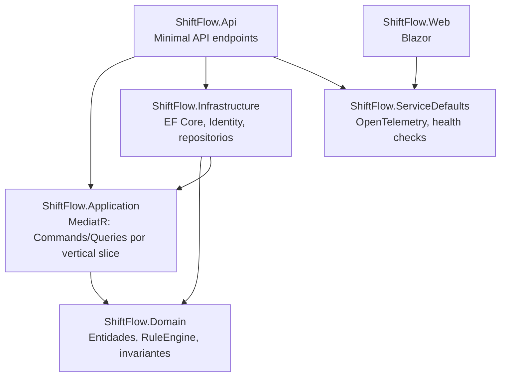

# 🏗️ Arquitectura

| Campo | Valor |
|-------|-------|
| Relacionado | [ADR-001](../architecture/decisions/ADR-001-stack-tecnologico-mvp.md), [ADR-002](../architecture/decisions/ADR-002-cliente-web-only-mvp.md), [ADR-003](../architecture/decisions/ADR-003-motores-planificacion-mvp.md), [ADR-004](../architecture/decisions/ADR-004-layout-solucion.md), [ADR-005](../architecture/decisions/ADR-005-auth-basica-mvp.md), [ADR-007](../architecture/decisions/ADR-007-ef-migrations.md) |

Este documento es un resumen visual de las decisiones ya fijadas en [`architecture/decisions/`](../architecture/decisions/README.md). Ante cualquier discrepancia, gana el ADR.

---

## 🧩 Componentes en tiempo de ejecución

`ShiftFlow.Web` es un cliente BFF: no habla directamente con la base de datos ni implementa reglas de negocio; llama al `Api` con el `AccessToken` emitido en el login ([ADR-005](../architecture/decisions/ADR-005-auth-basica-mvp.md)) y resuelve la URL de la Api vía service discovery de Aspire (`https+http://api`) — por eso no se depura `Web`/`Api` sueltos, sino `AppHost`.

## 🧱 Capas (dependencias de proyecto)

`Domain` no depende de nada ([ADR-004](../architecture/decisions/ADR-004-layout-solucion.md)): entidades (`Organization`, `Department`, `Employee`, `ShiftType`, `ShiftAssignment`, `Leave`), interfaces de repositorio y el `RuleEngine`. `Application` orquesta casos de uso vía MediatR (CQRS por vertical slice, ver [`handbook/12-cqrs-vertical-slices.md`](../handbook/12-cqrs-vertical-slices.md)). `Infrastructure` implementa persistencia (Npgsql/PostgreSQL) e Identity. `Api` solo mapea HTTP → `IMediator.Send`.

## 🗂️ Contextos / entidades de dominio

| Contexto | Entidades | Invariantes clave |
|----------|-----------|---------------------|
| 🏢 Organización | `Organization` | Umbral de descanso mínimo (`MinimumRest`) para HR-03 |
| 🧑‍💼 Estructura | `Department`, `Employee`, `ShiftType` | Activación/desactivación (soft state, no borrado físico) |
| 📅 Planificación | `ShiftAssignment` (`Assigned` / `Cancelled`) | Ver Rule Engine |
| 🌴 Ausencias | `Leave` (`Active` / `Cancelled`) | Cobertura de intervalo |

Ver también [`handbook/11-ddd-and-bounded-contexts.md`](../handbook/11-ddd-and-bounded-contexts.md).

---

## ⚖️ Rule Engine v1 (`ShiftFlow.Domain.Rules.RuleEngine`)

Evalúa hard rules sobre una asignación candidata; cualquier violación bloquea el alta ([ADR-003](../architecture/decisions/ADR-003-motores-planificacion-mvp.md)):

| Código | Regla | Condición |
|--------|-------|-----------|
| 🔁 `HR-01` | Solape | El empleado ya tiene un `ShiftAssignment` `Assigned` cuyo intervalo `[StartAt, EndAt)` solapa con el candidato |
| 🌴 `HR-02` | Ausencia activa | Un `Leave` `Active` del empleado cubre el intervalo candidato |
| 😴 `HR-03` | Descanso mínimo | El hueco respecto a otro turno `Assigned` no solapado es menor que `Organization.MinimumRest` |

El endpoint `AssignShift` devuelve el primer `RuleViolation` como `400` con `{ error, code, title, body }`; la UI de calendario muestra `title`/`body` sin reimplementar las reglas (ver [`docs/api.md`](api.md) y `GET /api/rules/explain`). Cómo provocar cada regla desde la UI: [`docs/user-guide.md`](user-guide.md).

## 💾 Persistencia y migraciones

- PostgreSQL vía Npgsql; esquema evolucionado con **migraciones EF Core** ([ADR-007](../architecture/decisions/ADR-007-ef-migrations.md)), aplicadas con `MigrateAsync` al arrancar la Api.
- Los tests de integración usan SQLite + `EnsureCreated` (esquema efímero, no migraciones).

## Autenticación (ADR-005)

ASP.NET Core Identity con cookie de sesión + un `AccessTokenService` que emite un token Bearer en `/api/auth/login`, consumido por `ShiftFlow.Web` como cliente BFF. Único rol activo: `Administrator`. Detalle: [ADR-005](../architecture/decisions/ADR-005-auth-basica-mvp.md).

---

## ⚙️ Configuración

| Clave | Dónde | Valor por defecto | Para qué |
|-------|-------|--------------------|----------|
| `ConnectionStrings:shiftflow` | `src/ShiftFlow.Api/appsettings.json` | `Host=localhost;Port=5433;Database=shiftflow;Username=shiftflow;Password=shiftflow` | Conexión a PostgreSQL (solo desarrollo) |
| `Demo:SeedCatalog` | `appsettings.json` / `Demo__SeedCatalog` | `false` (activado por el perfil `https` del AppHost en Development) | Siembra el catálogo de demo ([§3.2 del runbook](runbook-local.md)) |
| `Authentication:DemoUser:Password` | `dotnet user-secrets` / `Authentication__DemoUser__Password` | `ChangeMe!123` si no hay override | Contraseña de `demo.admin` (ver [usuario demo](runbook-local.md#8-usuario-demo)) |

## Limitaciones conocidas

- Un único rol de aplicación: `Administrator`. No hay roles de solo lectura ni multi-tenant real más allá de la organización activa.
- Sin Swagger UI interactiva; solo el JSON de `/openapi/v1.json` en Development. Detalle: [`docs/api.md`](api.md).
- Producción usa PostgreSQL con migraciones EF Core; los tests de integración usan SQLite + `EnsureCreated` — no son el mismo motor ni el mismo mecanismo de esquema.
- El Rule Engine (`HR-01`/`HR-02`/`HR-03`) es v1: reglas duras fijas, sin motor de reglas configurable ni soft rules.

## 📌 Decisiones no cubiertas aquí

Cliente Web-only (MAUI diferido) → [ADR-002](../architecture/decisions/ADR-002-cliente-web-only-mvp.md). Estándares de código (regiones, XML docs, sin `var`) → [ADR-006](../architecture/decisions/ADR-006-coding-standards.md), aplicado también vía [`.cursor/rules/coding-standards-csharp.mdc`](../.cursor/rules/coding-standards-csharp.mdc) del pack.
