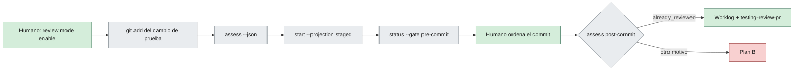

# Piloto de RDD híbrido (review antes del commit)

> [!NOTE]
> Guion operativo del piloto de RDD de gentle-ai (`gentle-ai review …`) en ShiftFlow. Aplica la cláusula RDD de la sección «Tooling externo» de [`AGENTS.md`](../AGENTS.md#tooling-externo-gentle-ai) y el [ADR-004 de sdaf-core](../sdaf-core/architecture/decisions/ADR-004-tooling-externo-de-agentes.md) (no confundir con el ADR-004 de layout de este repo).
>
> Revisado contra el `--help` de gentle-ai `main@520ed86e8` (= `tooling.gentle_ai` en [`sdaf.config.yaml`](../sdaf.config.yaml)) el 2026-09-27T08:40+02:00. Si el binario cambia, vuelve a leer la ayuda antes de ejecutar.

**En esta página:** [Propósito](#propósito) · [Qué se sabe](#qué-se-verificó-y-qué-no) · [Precondiciones](#precondiciones) · [Flujo](#flujo) · [Pasos](#pasos-del-piloto) · [Criterios](#criterios-c1c5) · [Plan B](#plan-b) · [Marcha atrás](#marcha-atrás) · [Worklog](#qué-registrar-en-el-worklog)

## Propósito

Comprobar si RDD puede usarse **sin excepción H06 §7** («híbrido 1», decisión humana del 2026-09-27):

- La review se hace sobre el candidato preparado (`git add` + `--projection staged`), **antes** del commit.
- El commit solo lo autoriza el encargo vigente del humano (el mensaje de ese turno) y contiene exactamente el árbol revisado.
- Tras el commit, el `assess` post-commit debe reconocer que ese rango ya está revisado (`already_reviewed`).

Límites que no cambian con el piloto:

| Regla | Fuente |
|-------|--------|
| El dictamen de RDD no es QG-Review; solo alimenta `testing-review-pr`. El merge exige revisión humana de [`CODEOWNERS`](../CODEOWNERS). | ADR-004 de sdaf-core, decisión 6 |
| La evidencia es el worklog. Engram y los recibos de RDD son caché. | ADR-004 de sdaf-core, decisión 3 |
| Commit, rama y remoto solo por encargo vigente. | H06 §7; ADR-004 de sdaf-core, decisión 5 |
| Activar o desactivar RDD es decisión humana. | [`AGENTS.md`](../AGENTS.md#tooling-externo-gentle-ai) |

## Qué se verificó y qué no

**Verificado** leyendo el `--help` del binario instalado:

| Comando | Hallazgo |
|---------|----------|
| `review mode` | «Any off wins»: con el global en off, un `enable` por clon no surte efecto. Estado al redactar: global off, clone-local unset. |
| `review start` | `--projection workspace\|staged` (`staged` «records post-commit delivery provenance»), `--consent relay\|granted\|declined`, `--locale es`, `--agent claude-code`, `--focus risk\|resilience\|readability\|reliability`, `--base-ref`, `--committed-only`. |
| `review assess` | Solo lectura: no crea autoridad de review. Con `--json` devuelve el sobre `gentle-ai.review-assessment/v1` con `review_due` y `review_due_reason`. |
| `review status` | Lee las autoridades del Git common directory: los recibos viven en `.git/`, no en el árbol de trabajo. `--gate` vale `pre-commit` por defecto. |
| `review stop-hook --agent claude-code` | Hooks `SessionStart` y `Stop` ya instalados en `~/.claude/settings.json`. En `SessionStart` registra la línea base; en `Stop`, si RDD está activo y hay un candidato nuevo, imprime un recordatorio para pasar por el preflight STATUS. Nunca ejecuta `review start`. |
| `review store-reset` | Borra el estado de linajes de review de este clon. Previsualiza por defecto y aplica con `--confirm`. Irreversible. |

Según la ayuda, la documentación pura grande usa siempre el foco `readability`.

**Sin confirmar** (lo que el piloto debe comprobar): los criterios [C1–C5](#criterios-c1c5). Tampoco se conoce el texto exacto que imprimen `review start`, `review status` ni el stop-hook; el guion no lo supone.

> [!WARNING]
> La guía del core ([`integracion-gentle-ai.md`](../sdaf-core/docs/integracion-gentle-ai.md#matriz-de-encaje)) dice que RDD «revisa commits, así que solo tiene sentido con excepción de commit». Con `--projection staged` es inexacto. Su corrección es un cambio aparte en el repo `sdaf-core`, fuera de este piloto.

## Precondiciones

| Requisito | Comprobación |
|-----------|--------------|
| RDD desactivado al empezar | `gentle-ai review mode status` |
| Árbol limpio | `git status` sin cambios |
| Rama de piloto creada por el humano | El agente no crea ramas (H06 §7) |
| Cambio de prueba pequeño y sin código de producto | P. ej. una línea de documentación en `docs/`; así no hace falta Gate 0 |
| Encargo del humano que nombre el piloto | La activación y el commit se autorizan en su turno |

## Flujo



Verde: decisión humana o evidencia. Gris: pasos de herramienta. Rojo: desvío.

## Pasos del piloto

Desde la raíz del repo, en la rama de piloto.

**1. Estado de partida.**

```bash
gentle-ai review mode status
git status
```

Esperado: modo efectivo off con fuente global; árbol limpio.

**2. Activar RDD (lo ejecuta o lo ordena el humano).**

```bash
gentle-ai review mode enable
```

El global manda: por «Any off wins», un `enable` solo por clon no basta. Si hay otros repos donde no se quiera RDD:

```bash
gentle-ai review mode disable --scope clone --cwd <ruta del otro repo>
```

Vuelve a ejecutar `gentle-ai review mode status`. Esperado: modo efectivo on.

**3. Cambio de prueba y preparación.**

```bash
git add <ruta del cambio de prueba>
git status
```

Esperado: solo el cambio de prueba en el índice.

**4. Evaluación previa (solo lectura).**

```bash
gentle-ai review assess --cwd . --json
```

Anota `review_due` y `review_due_reason` del sobre `gentle-ai.review-assessment/v1`. No crea autoridad de review.

**5. Review del candidato preparado.**

```bash
gentle-ai review start --projection staged --consent relay --locale es --agent claude-code
```

Sigue las transiciones que devuelva el comando, tal cual. Si pide consentimiento, lo decide el humano (C4). No se sabe de antemano qué transiciones aparecerán; anótalas en el worklog.

**6. Estado antes del commit.**

```bash
gentle-ai review status --gate pre-commit
```

Anota lo que indique sobre el candidato. Si el índice cambió tras la review, repite desde el paso 4.

**7. Commit (solo si el humano lo ordena en su turno).**

El commit contiene exactamente el árbol revisado: nada de `git add` entre el paso 5 y el commit. Anota el `sha`.

**8. Evaluación post-commit (C1).**

```bash
gentle-ai review assess --cwd . --base-ref <base> --committed-only --json
```

`<base>` es el último límite revisado. En el primer commit del piloto es el punto de rama: `git merge-base HEAD main`. Esperado: `review_due_reason: already_reviewed`.

**9. Árbol de trabajo (C3).**

```bash
git status
```

Esperado: limpio. Los recibos viven en `.git/` y no deben aparecer como cambios.

**10. Stop-hook (C2).**

Al cerrar un turno con un candidato nuevo preparado y RDD activo, observa la salida del hook `Stop`. Esperado: un recordatorio para pasar por el preflight STATUS, sin bloquear el cierre ni ejecutar `review start`.

## Criterios C1–C5

| Id | Criterio | Cómo se comprueba | Resultado |
|----|----------|-------------------|-----------|
| C1 | El commit de un candidato revisado con `staged` sale `already_reviewed` | Paso 8 | _pendiente_ |
| C2 | El stop-hook solo recuerda; no bloquea | Paso 10 | _pendiente_ |
| C3 | No aparecen artefactos en el árbol de trabajo | Pasos 3, 6 y 9 (`git status`) | _pendiente_ |
| C4 | El consentimiento relay llega en castellano | Paso 5 | _pendiente_ |
| C5 | Coste y tiempo aceptables | Duración de los pasos 4–8 y uso de la sesión | _pendiente_ |

## Plan B

Si falla C1, el humano elige una de estas salidas:

| Opción | Coste | Qué se pierde |
|--------|-------|---------------|
| Aceptar una segunda review post-commit | Doble: review del candidato y review del commit | Nada de trazabilidad; más tiempo y consumo |
| Review sobre el workspace (`--projection workspace`) | Una review | El enlace entre la review y el commit; el worklog lo suple a mano |
| Volver a RDD desactivado | Ninguno | La review automatizada |

## Marcha atrás

```bash
gentle-ai review mode disable
gentle-ai review mode status
```

Esperado: modo efectivo off. Si se quiere borrar el estado de linajes de este clon, primero solo la vista previa:

```bash
gentle-ai review store-reset
```

Aplicarlo (`--confirm`) es irreversible: lo decide el humano.

## Qué registrar en el worklog

El worklog del piloto es la evidencia; los recibos de `.git/` no.

| Dato | De dónde sale |
|------|---------------|
| Tier y motivo | `review_due` y `review_due_reason` de los pasos 4 y 8 |
| Review o linaje | Identificador que devuelvan `review start` o `review status` |
| `sha` y `rama` | Paso 7 (frontmatter del worklog) |
| Criterios | Tabla [C1–C5](#criterios-c1c5) con su resultado |
| Decisión posterior | Mantener, plan B o marcha atrás, con su motivo |

El dictamen se cita en `testing-review-pr`; la aceptación sigue siendo de `CODEOWNERS`.

## Relacionado

| | Destino | Por qué |
|--|---------|---------|
| 📖 | [`AGENTS.md`](../AGENTS.md#tooling-externo-gentle-ai) | Cláusula RDD y precedencia |
| 📖 | [ADR-004 de sdaf-core](../sdaf-core/architecture/decisions/ADR-004-tooling-externo-de-agentes.md) | Decisiones 3, 5 y 6 |
| 📖 | [H06 §7](../sdaf-core/handbook/06-ai-agent-framework.md#7-restricciones-globales) | Commit y remoto solo por encargo vigente |
| 🛠️ | [`integracion-gentle-ai.md`](../sdaf-core/docs/integracion-gentle-ai.md) | Guía del core (con la inexactitud señalada) |
| 🗂️ | [Worklog GENTLE-AI-RDD](../worklogs/GENTLE-AI-RDD/Iteration-001.md) | Iteración que introduce este guion |
