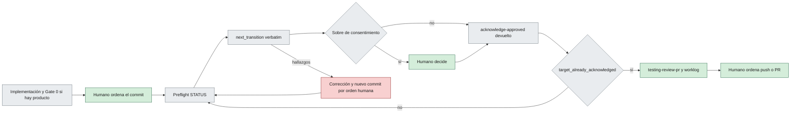

# RDD antes del PR: flujo y resultados del piloto

> [!NOTE]
> Flujo operativo de RDD de gentle-ai (`gentle-ai review …`) en ShiftFlow y resultados del piloto que lo motivó. Aplica la cláusula RDD de la sección «Tooling externo» de [`AGENTS.md`](../AGENTS.md#tooling-externo-gentle-ai) y el [ADR-004 de sdaf-core](../sdaf-core/architecture/decisions/ADR-004-tooling-externo-de-agentes.md) (no confundir con el ADR-004 de layout de este repo).
>
> Verificado con gentle-ai `main@520ed86e8` (= `tooling.gentle_ai` en [`sdaf.config.yaml`](../sdaf.config.yaml)) en el piloto del 2026-09-27T09:43–09:57+02:00. Decisión humana del 2026-09-27 («Opción 1»). Si el binario cambia, vuelve a leer la ayuda y el preflight antes de ejecutar nada.

**En esta página:** [Propósito](#propósito) · [Flujo](#flujo-operativo) · [Pasos](#pasos) · [Stop-hook](#el-stop-hook) · [Coste](#coste-una-o-dos-reviews-por-cambio) · [Resultados del piloto](#resultados-del-piloto) · [Pendiente](#lo-que-queda-por-probar) · [Marcha atrás](#marcha-atrás) · [Guía del core](#aviso-sobre-la-guía-del-core) · [Worklog](#qué-registrar-en-el-worklog)

## Propósito

RDD revisa el **rango ya commiteado**, después de un commit ordenado por el humano y **antes** del push o del PR. No hay excepción H06 §7: el commit, la rama y el remoto siguen exigiendo una orden humana en el turno vigente.

El piloto probó antes la review del candidato preparado (`--projection staged`), previa al commit. No funcionó: esa review no se enlaza al commit (ver [C1](#resultados-del-piloto)). Ese flujo **no** se recomienda; queda solo como resultado.

Límites que no cambian:

| Regla | Fuente |
|-------|--------|
| El dictamen de RDD no es QG-Review; solo alimenta `testing-review-pr`. El merge exige revisión humana de [`CODEOWNERS`](../CODEOWNERS). | ADR-004 de sdaf-core, decisión 6 |
| La evidencia es el worklog. Engram y los recibos de RDD son caché. | ADR-004 de sdaf-core, decisión 3 |
| Commit, rama, push y PR solo por orden humana en el turno vigente. | [H06 §7](../sdaf-core/handbook/06-ai-agent-framework.md#7-restricciones-globales); ADR-004 de sdaf-core, decisión 5 |
| Activar o desactivar RDD es decisión humana. | [`AGENTS.md`](../AGENTS.md#tooling-externo-gentle-ai) |

> [!IMPORTANT]
> **Nunca inventes el comando de review.** `review start` exige `--contract`, `--target`, `--target-evidence` y `--projection`, que solo conoce el preflight. Ejecuta siempre, tal cual, el `next_transition.execute` que devuelve `gentle-ai review status`.

## Flujo operativo



Verde: decisión humana o evidencia. Gris: trabajo del agente y pasos de herramienta. Rojo: desvío.

## Pasos

Desde la raíz del repo, en la rama de trabajo.

**1. Implementación.** Si toca código de producto, Gate 0 antes ([handbook 05](../sdaf-core/handbook/05-development-workflow.md)). El agente deja los cambios sin commit hasta que el humano lo ordene.

**2. Commit por orden humana en el turno.** Anota el `sha`.

**3. Preflight STATUS, sin selector.**

```bash
gentle-ai review status --cwd . --contract gentle-ai.review-integration/v2 --agent claude-code --next-transition
```

Con el árbol limpio tras el commit, el preflight deduce el rango commiteado: en el piloto tomó `--base-ref` = merge-base con `main` y `--committed-only=true` (candidato `base-diff`).

> [!WARNING]
> Si quedan cambios sin commitear, el preflight sin selector revisa esos cambios (`current-changes`, proyección `workspace`), no el rango. Fijar el rango con `--base-ref <merge-base> --committed-only` en ese mismo comando **no sirve con cambios pendientes**: falla con `operation_failed` («unrelated target status is inconsistent», comprobado el 2026-09-27T10:24+02:00). Con el árbol limpio funciona y da `fresh_target_ready` sobre el candidato `base-diff` (comprobado a las 09:52). Revisa el rango con el árbol limpio.

**4. Ejecutar verbatim `next_transition.execute`.** Es un `review start` con el candidato `base-diff`, `--committed-only` y `--consent=relay`. Si devuelve un sobre de consentimiento, trasládalo al humano **sin responderlo por él**.

**5. Si el estado queda `approved`**, ejecuta el `acknowledge-approved` que devuelva la transición siguiente, también tal cual.

**6. Repite el preflight** hasta que `next_transition.reason_code` sea `target_already_acknowledged`. Si la review deja hallazgos, la corrección es otro cambio: su commit exige otra orden humana y vuelve al paso 3.

**7. `testing-review-pr`** cita el linaje (`review-…`) y los hallazgos. El dictamen no sustituye a QG-Review.

**8. Worklog:** linaje, `sha` y `review_due_reason` (ver [Qué registrar](#qué-registrar-en-el-worklog)). Para el motivo, `assess` es solo lectura:

```bash
gentle-ai review assess --cwd . --base-ref <último límite revisado> --committed-only --json
```

**9. Push o PR solo por orden humana**, con la review cerrada (`target_already_acknowledged`) y sus hallazgos citados en la descripción del PR.

## El stop-hook

Los hooks `SessionStart` y `Stop` de gentle-ai están instalados en `~/.claude/settings.json`. Según la ayuda, `SessionStart` registra la línea base y `Stop`, con RDD activo y un candidato nuevo, remite al preflight STATUS. El hook no ejecuta `review start`; lo hace el agente siguiendo el preflight.

| Qué hace | Detalle observado en el piloto |
|----------|--------------------------------|
| **Bloquea** | Llega a Claude Code como error de hook bloqueante: el turno no se cierra hasta atenderlo. Según su texto, avisa una vez por sesión y candidato. |
| Usa el preflight sin selector | `gentle-ai review status --cwd <repo> --contract gentle-ai.review-integration/v2 --agent claude-code --next-transition`. Con cambios sin commit revisa `current-changes`; con el árbol limpio, el rango `base-diff`. |
| No reconoce reviews de otro tipo de candidato | Una review `staged` del mismo árbol no le basta: exige otra `workspace`. |
| Se dispara con trabajo a medias | Salta en cada cierre de turno con cambios sin commit, aunque el trabajo esté a medias o lo esté haciendo un subagente en segundo plano (observado el 2026-09-27T10:00+02:00). |

Cómo atenderlo:

- Sigue su preflight y ejecuta verbatim la transición que devuelva, como en los [pasos 4–6](#pasos). Si devuelve un sobre de consentimiento, se traslada al humano.
- **No revises candidatos intermedios.** Un candidato a medias cambiará en cuanto termine el trabajo y su review no servirá. Si el hook bloquea sobre un candidato intermedio (p. ej. con un subagente aún trabajando), di en la respuesta que no se revisa por ser intermedio y cierra el turno: el hook avisa una vez por candidato y no vuelve a bloquear ese mismo (observado el 2026-09-27T10:00+02:00). Al terminar el trabajo, pasa el preflight sobre el **candidato final** antes de darlo por terminado.
- **Ficheros nuevos sin seguimiento.** Si el candidato incluye ficheros sin `git add`, el preflight devuelve `intended_untracked_selection_required` (transición `collect`) con `eligible_paths_json` y `expected_untracked_inventory`. Declara los que forman parte del cambio repitiendo el preflight con `--projection workspace --untracked-scope select --intended-untracked <ruta> --expected-untracked-inventory <sha256>`; después ejecuta verbatim el `start` que devuelva.

## Coste: una o dos reviews por cambio

Bajo H06 §7 el agente suele cerrar el turno con cambios sin commit, a la espera de la orden. El stop-hook revisa entonces esos cambios (`current-changes`) y, tras el commit, el rango (`base-diff`). Las dos reviews tienen `target_identity` distinto aunque el árbol sea el mismo.

| Situación del turno | Reviews por cambio |
|---------------------|--------------------|
| El humano ordena implementación y commit en el mismo turno | 1 (`base-diff`) |
| El turno termina sin cambios nuevos sin commitear | 1 (`base-diff`) |
| El turno termina con cambios sin commit y el commit llega en otro turno | 2 (`current-changes` y `base-diff`) |

Para un cambio `passive` (solo documentación) el coste es despreciable: sin lentes ni consentimiento, en segundos. Con lentes, el coste se duplica en el tercer caso.

## Resultados del piloto

Piloto del 2026-09-27T09:43–09:57+02:00 en la rama `chore/piloto-rdd`. RDD activado en el global (`gentle-ai review mode enable`) por decisión humana; sigue activo.

Candidato: `pr: 17` y `sha` en [`worklogs/GENTLE-AI-RDD/Iteration-001.md`](../worklogs/GENTLE-AI-RDD/Iteration-001.md), 6 líneas, preparado con `git add`. `assess --json` → `risk passive` (`non_executable_only`), `review_due false`. Commit `819c5f5` por orden humana; árbol `485029a`, igual al revisado.

| Id | Criterio | Resultado |
|----|----------|-----------|
| C1 | Tras el commit, la review previa (`staged`) sale `already_reviewed` | ❌ `assess --base-ref 437d745 --committed-only` → `review_due_reason passive`, candidato `base-diff` con `consumed false`; el STATUS del rango da `fresh_target_ready` con `target_identity` nuevo (`ba2ff37…`). Mismo `base_tree`, `candidate_tree` y `paths_digest`, pero la identidad incluye el tipo de candidato (`current-changes` frente a `base-diff`). |
| C2 | El stop-hook solo recuerda; no bloquea | ❌ Bloquea el cierre del turno y exige su propia review (ver [Stop-hook](#el-stop-hook)). |
| C3 | Sin artefactos en el árbol de trabajo | ✅ Recibos en `.git/gentle-ai/review-transactions/v2/`; `git status` limpio. |
| C4 | El consentimiento relay llega en castellano | ◐ Parcial: con el cambio de gobierno de la Opción 1 (riesgo `medium`), `start` devolvió un sobre `consent_required` (`blocking: true`) que se trasladó al humano, quien respondió `granted`. Llegó **en inglés**: el `start` que emite el preflight no lleva `--locale es`. |
| C5 | Coste y tiempo aceptables | ✅ Segundos, solo por ser `passive`. |

Tres reviews para un único cambio:

| Linaje | Candidato | Origen | Resultado |
|--------|-----------|--------|-----------|
| `review-39a32bb0b9ec3599` | `staged` (contrato v1) | Guion del piloto, antes del commit | `closed`, `approved`, `risk_level low`, sin lentes; confirmada |
| `review-7f2aa92d5834cf19` | `current-changes`, `workspace` (contrato v2) | 1.er disparo del stop-hook, antes del commit | `passive`, aprobada, confirmada |
| `review-0f025da387926c33` | `base-diff`, rango `437d745..819c5f5` | 2.º disparo del stop-hook, tras el commit | `passive`, aprobada, confirmada; `target_already_acknowledged` |

Review con lentes (cambio de la Opción 1, antes del commit):

| Linaje | Candidato | Resultado |
|--------|-----------|-----------|
| `review-e3475e7f33d2f7da` | `current-changes`, `workspace`, 4 ficheros y 296 líneas, con `Iteration-002.md` declarado como sin seguimiento | Riesgo `medium` (`executable_change` en `AGENTS.md`), consentimiento `granted`, lente `review-reliability` lanzada por `capture-result --agent claude-code` (59 s). Aprobada con 3 hallazgos no bloqueantes (2 `WARNING`, 1 `SUGGESTION`), corregidos después como cambio aparte; confirmada. |

Otros hallazgos:

- El `review start --projection staged --agent claude-code` del guion anterior fallaba: `start --agent` exige `--contract`, y un start negociado exige además `--target` y `--projection`. Por eso el flujo actual solo ejecuta lo que devuelve el preflight.
- `status --gate pre-commit` tras la review `staged` devolvió `approved_acknowledgement_required`; el `acknowledge-approved` devuelto quemó la autoridad y dejó `target_already_acknowledged`.
- RDD trata `AGENTS.md` como cambio ejecutable: todo cambio de gobierno sale `medium` y pide consentimiento.
- Con lentes, `capture-result --agent claude-code` lanza el revisor por su cuenta (`--materialize` no está disponible para `claude-code`) y devuelve el `acknowledge-approved` si la review queda aprobada. Los hallazgos no bloqueantes no reabren la review: se tratan como trabajo aparte, que es un candidato nuevo.

## Lo que queda por probar

| Qué | Cómo |
|-----|------|
| C4: consentimiento en castellano | El `start` emitido no lleva `--locale es`; ver si gentle-ai permite fijarlo o si se acepta en inglés |
| Review con lentes sobre código | Un cambio de código con orden humana de commit; con Gate 0 si toca producto (la única review con lentes fue sobre gobierno y documentación) |
| Hallazgos bloqueantes | Transición de corrección (`correction_budget`) con una review que no salga aprobada |
| Coste real del caso de 2 reviews con lentes | El mismo cambio, cerrando un turno antes del commit |

## Marcha atrás

```bash
gentle-ai review mode disable
gentle-ai review mode status
```

Esperado: modo efectivo off. Si se quiere borrar el estado de linajes de este clon, primero solo la vista previa:

```bash
gentle-ai review store-reset
```

Aplicarlo (`--confirm`) es irreversible: lo decide el humano.

## Aviso sobre la guía del core

> [!WARNING]
> La guía del core ([`integracion-gentle-ai.md`](../sdaf-core/docs/integracion-gentle-ai.md#matriz-de-encaje)) dice que RDD «revisa commits, así que solo tiene sentido con excepción de commit». Es inexacto en ambos sentidos: RDD sirve **sin** excepción H06 §7, pero **después** de un commit ordenado por el humano, no antes. Su corrección es un cambio aparte en el repo `sdaf-core`.

## Qué registrar en el worklog

El worklog es la evidencia; los recibos de `.git/` no.

| Dato | De dónde sale |
|------|---------------|
| Linaje de cada review | `review-…` del `next_transition` o de la respuesta de `review start` |
| `review_due_reason` y tier | `assess --base-ref <límite> --committed-only --json` |
| `sha`, `rama` y `commit` | El commit ordenado (frontmatter del worklog) |
| Reviews extra | Si el stop-hook exigió una review de `current-changes`, su linaje y el motivo |
| Hallazgos y consentimiento | Qué devolvió la review y qué decidió el humano |

El dictamen se cita en `testing-review-pr` y en el PR; la aceptación sigue siendo de `CODEOWNERS`.

## Relacionado

| | Destino | Por qué |
|--|---------|---------|
| 📖 | [`AGENTS.md`](../AGENTS.md#tooling-externo-gentle-ai) | Cláusula RDD y precedencia |
| 📖 | [ADR-004 de sdaf-core](../sdaf-core/architecture/decisions/ADR-004-tooling-externo-de-agentes.md) | Decisiones 3, 5 y 6 |
| 📖 | [H06 §7](../sdaf-core/handbook/06-ai-agent-framework.md#7-restricciones-globales) | Commit y remoto solo por orden humana en el turno |
| 🛠️ | [`testing-review-pr`](../skills/testing-review-pr/) | Skill que cita el linaje |
| 🛠️ | [`integracion-gentle-ai.md`](../sdaf-core/docs/integracion-gentle-ai.md) | Guía del core (con la inexactitud señalada) |
| 🗂️ | [Worklog GENTLE-AI-RDD 001](../worklogs/GENTLE-AI-RDD/Iteration-001.md) | Iteración que introdujo el guion del piloto |
| 🗂️ | [Worklog GENTLE-AI-RDD 002](../worklogs/GENTLE-AI-RDD/Iteration-002.md) | Piloto, resultados y paso a RDD antes del PR |
