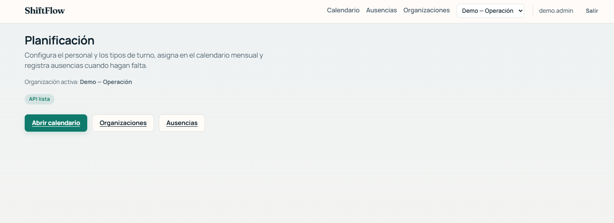
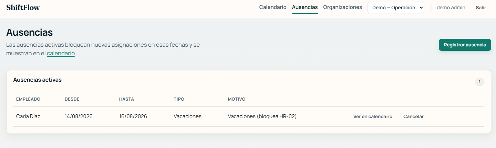

# 🧭 Guía de uso

| Campo | Valor |
|-------|-------|
| Relacionado | [SPEC-PRD-002](../specs/product/SPEC-PRD-002-demo-journey.md), [SPEC-PRD-003](../specs/product/SPEC-PRD-003-ui-demo-nfr.md), [PBI-003](../backlog/PBI-003-organization-department-employee.md)…[PBI-008](../backlog/PBI-008-blazor-shell-crud.md) |

Recorrido funcional de ShiftFlow tras el arranque local ([`docs/runbook-local.md`](runbook-local.md)). Capturas reales en [`docs/presentation/mvp-0.1/captures/`](presentation/mvp-0.1/captures/README.md).

---

## 🔑 1. Login

`/login` — usuario `demo.admin`, contraseña `ChangeMe!123` (o el override configurado, ver [usuario demo](runbook-local.md#8-usuario-demo)).

Tras autenticar, el token Bearer emitido se usa para todas las llamadas del cliente Web al Api (ver [`docs/architecture.md`](architecture.md#autenticación-adr-005)).

## 🏢 2. Elegir organización

La barra superior tiene un selector de organización activa; toda la app (calendario, ausencias, maestros) opera sobre esa organización. Si arrancaste con el catálogo de demo (`Demo:SeedCatalog=true`, default en Development), verás `Demo — Operación` y `Demo — Descanso`; si no, créala tú mismo en `/organizations`.

## 🧑‍💼 3. Maestros: organización → departamentos → empleados → tipos de turno

`/organizations` lista las organizaciones existentes; `/organizations/{id}` abre el detalle con pestañas **Personal** y **Tipos**, más los ajustes de la organización (incluido el umbral de descanso mínimo que activa `HR-03`).

Orden recomendado para dar de alta un journey completo desde cero:

1. Crear la organización.
2. Crear al menos un departamento.
3. Crear empleados asociados al departamento.
4. Crear tipos de turno (nombre, código opcional, horario por defecto).

Departamentos, empleados y tipos de turno se pueden **desactivar** (no se borran); un empleado/tipo inactivo no aparece como candidato al asignar. Contratos completos: [`docs/api.md`](api.md).

## 📅 4. Calendario y asignación de turnos

`/calendar` muestra la grilla del mes con un panel lateral de asignación. Al asignar un turno (empleado + tipo de turno + intervalo), el [motor de reglas](architecture.md) evalúa:

- ✅ **Éxito** → el turno aparece en la grilla como `Assigned`.
- 🚫 **Rechazo** → `400` con un código de regla (`HR-01`/`HR-02`/`HR-03`), título y explicación; el calendario los muestra tal cual, sin reinterpretarlos.

Un turno asignado se puede **cancelar** (pasa a `Cancelled`; deja de contar para solapes o descanso mínimo).

### 🎯 Provocar cada regla (para practicar o para demo)

| Regla | Cómo provocarla |
|-------|-------------------|
| 🔁 `HR-01` (solape) | Asignar al mismo empleado un segundo turno cuyo intervalo se cruza con uno ya `Assigned` |
| 🌴 `HR-02` (ausencia) | Asignar un turno a un empleado con un `Leave` activo que cubra ese intervalo |
| 😴 `HR-03` (descanso) | Con `MinimumRest` > 0 en la organización, asignar un turno cuyo hueco respecto a otro turno del empleado sea menor que el umbral |

## 🌴 5. Ausencias (leaves)

`/leaves` — alta y cancelación de ausencias de la organización activa (empleado, fecha inicio/fin inclusive, tipo y motivo opcionales). Una ausencia `Active` que cubra un intervalo bloquea la asignación de turnos en ese rango (`HR-02`).

## ⚖️ 6. Explicación de reglas

`GET /api/rules/explain?code=HR-01` (también `HR-02`/`HR-03`) devuelve la explicación en lenguaje natural de una regla, para soporte/consulta fuera del flujo de asignación. Un código no soportado devuelve `400`. Detalle de contrato: [`docs/api.md`](api.md#reglas).

---

## 🕒 Convención horaria

> 💡 Los instantes de turno se guardan y comparan en **UTC** (`DateTimeOffset` con offset 0); Npgsql no acepta offsets locales en `timestamptz`. La UI de calendario usa el mismo convenio — ten esto en cuenta al interpretar horas al probar en local.
